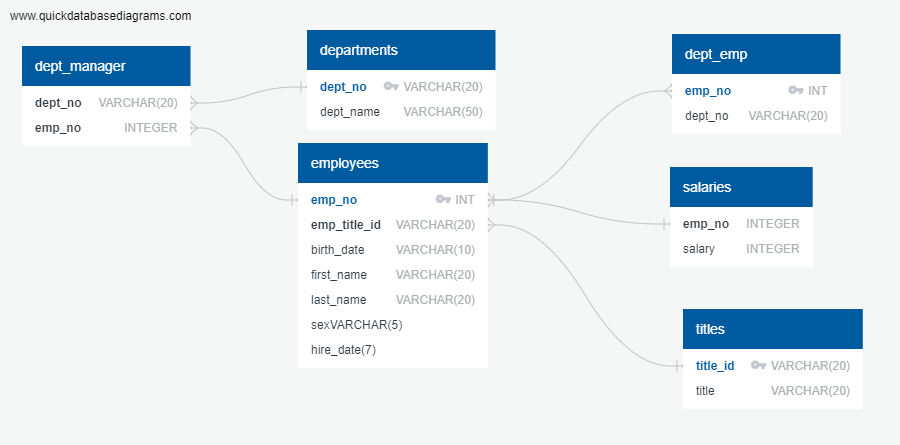

# sql-challenge

# SQL - Employee Database: Divided into three parts
Data modeling, data engineering, and data analysis


## Data Modeling
Inspect the CSV files, and then sketch an Entity Relationship Diagram of the tables. To create the sketch, feel free to use a tool like QuickDBD


## Data Analysis

Once you have a complete database, do the following:

1. List the employee: employee number, last name, first name, sex, and salary.
```python
SELECT employees.emp_no, employees.last_name, employees.first_name, employees.sex, salaries.salary
FROM employees
JOIN salaries
ON employees.emp_no = salaries.emp_no
order by employees.emp_no;
```

2. List first name, last name, and hire date for employees who were hired in 1986.
```python
SELECT first_name, last_name, hire_date 
FROM employees
WHERE hire_date BETWEEN '1/1/1986' AND '12/31/1986'
ORDER BY hire_date;
```
3. List the manager of each department with the following information: department number, department name, the manager's employee number, last name, first name.
```python 
SELECT departments.dept_no, departments.dept_name, dept_manager.emp_no, employees.last_name, employees.first_name
FROM departments
JOIN dept_manager
ON dept_manager.emp_no = employees.emp_no;
JOIN employees
ON departments.dept_no = dept_manager.dept_no
```

4. List the department of each employee with the following information: employee number, last name, first name, and department name.
```python
SELECT dept_emp.emp_no, employees.last_name, employees.first_name, departments.dept_name
FROM dept_emp
JOIN employees
ON dept_emp.emp_no = employees.emp_no
JOIN departments
ON dept_emp.dept_no = departments.dept_no;
```

5. List first name, last name, and sex for employees whose first name is "Hercules" and last names begin with "B."
```python
SELECT employees.first_name, employees.last_name, employees.sex
FROM employees
WHERE first_name = 'Hercules'
AND last_name Like 'B%'
```
6. List all employees in the Sales department, including their employee number, last name, first name, and department name.
```python
SELECT  employees.emp_no as Employee_number, employees.last_name as Last_name, employees.first_name as First_name, departments.dept_name as Department_name
FROM dept_emp
JOIN employees
ON dept_emp.emp_no = employees.emp_no
JOIN departments
ON dept_emp.dept_no = departments.dept_no
WHERE departments.dept_name = 'Sales';
```

7. List all employees in the Sales and Development departments, including their employee number, last name, first name, and department name.
```python
FROM dept_emp
JOIN employees
ON dept_emp.emp_no = employees.emp_no
JOIN departments
ON dept_emp.dept_no = departments.dept_no
WHERE departments.dept_name = 'Sales' 
OR departments.dept_name = 'Development';
```

8. In descending order, list the frequency count of employee last names, i.e., how many employees share each last name.
```python
SELECT last_name,
COUNT(last_name) AS "frequency"
FROM employees
GROUP BY last_name
ORDER BY
COUNT(last_name) DESC;
```


